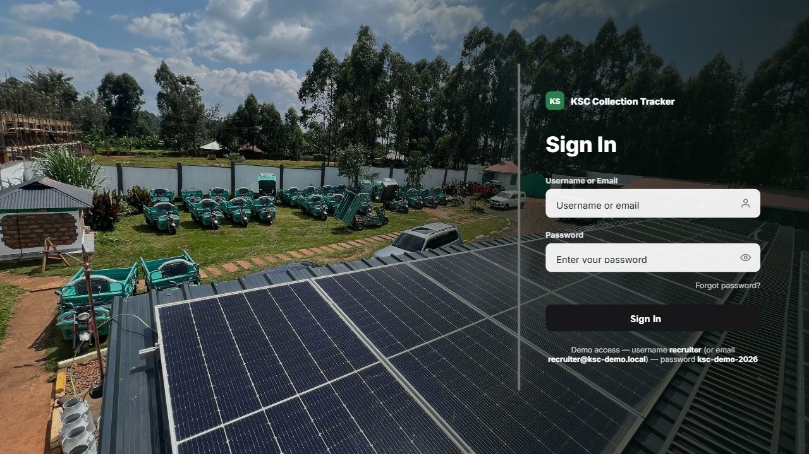
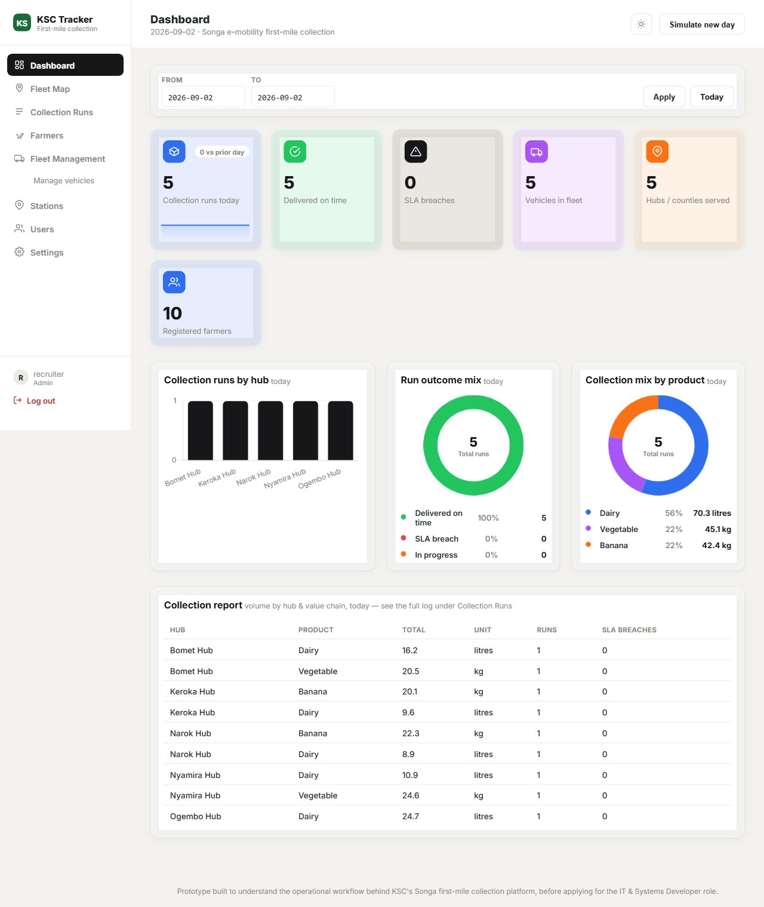
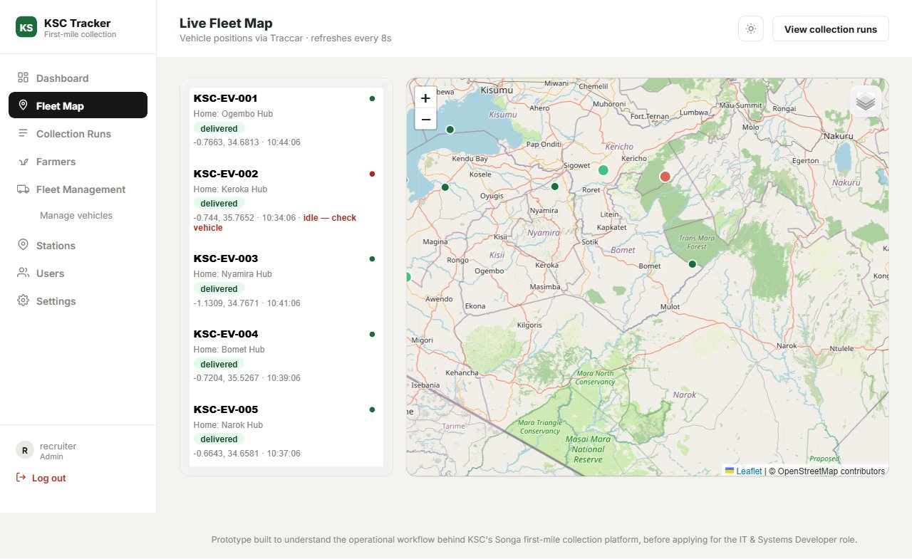
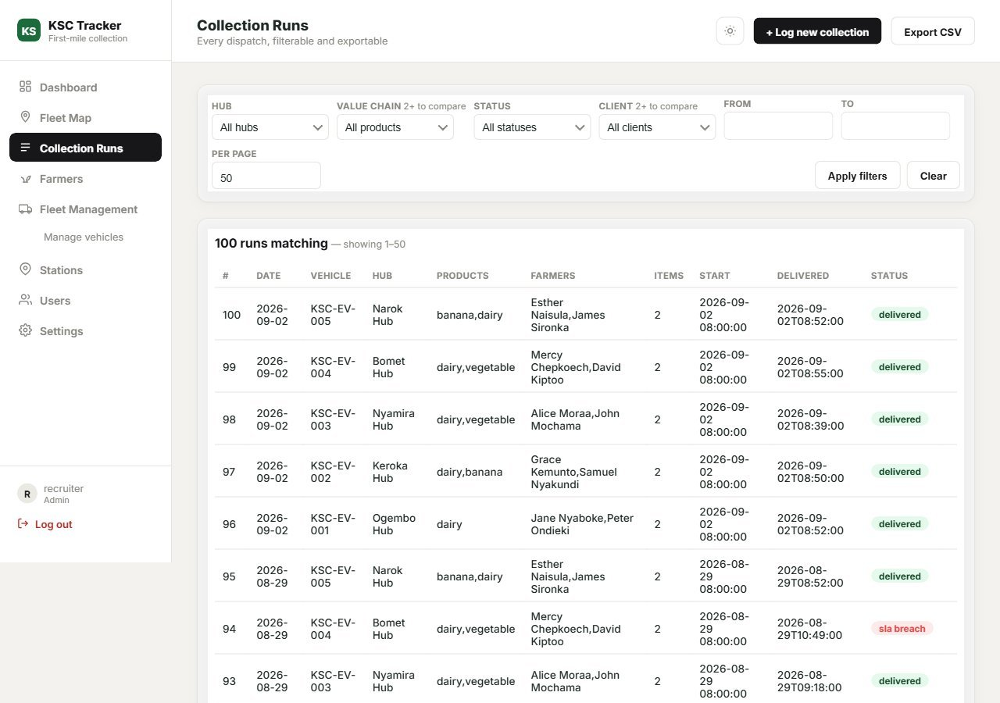

# First-Mile Collection & Fleet Dispatch Tracker

A small working prototype built to understand the operational problem
behind Kisii Smart Community and Songa Mobility.



## The problem

KSC's Songa platform runs solar-charged
electric three-wheelers doing first-mile collection of dairy, banana, and
vegetable produce from smallholder farmers across Kisii, Nyamira, Bomet,
and Narok counties, delivering to hubs for onward sale, processing, or
chilling. That operation has three sharp edges an IT/systems role would
actually own:

- **Dairy is perishable.** A collection run that takes too long between
  pickup and delivery isn't just late, it's spoiled — someone needs to
  know *automatically*, not after a farmer complains.
- **The fleet is unattended.** Riders cover rural routes alone; a stalled
  vehicle, a battery swap that's run long, or a wrong turn all look the
  same from an office unless the vehicle's GPS is actually being watched.
- **Different people need different views.** A field agent logging a
  pickup, a station lead running one hub, and an admin overseeing all
  four counties should each see exactly their slice of the system — not
  a single undifferentiated dashboard everyone has full access to.

This project builds a small but *real* version of all three: SLA
breach detection, live GPS-based idle alerts, and role-based access
control — the same shape of problem KSC would need solved in
production, small enough to build and demo end to end.

## Screenshots

| Dashboard | Live Fleet Map |
|---|---|
|  |  |

**Collection Runs** — filterable log with SLA-breach flagging, CSV export, and a manual data-entry form:



## Technologies used

| Layer | Choice | Why |
|---|---|---|
| Backend | Python, Flask | Small enough to read end-to-end in one sitting; no framework magic hiding the routing/auth logic that's the point of the demo |
| Data | SQLite (`db.py`) | Zero setup for a recruiter cloning the repo — schema is plain, portable SQL so it maps cleanly onto MariaDB or ERPNext doctypes later |
| Fleet tracking | [Traccar](https://www.traccar.org/) REST API (`traccar_client.py`), with a mock fallback | A real, documented open-source GPS platform — not a fake stand-in — same HTTP Basic Auth + `/api/devices` / `/api/positions` calls a production integration would use |
| Frontend | Jinja2 templates, vanilla JS, Chart.js (CDN) | No build step; keeps the whole stack `pip install`-and-go |
| Maps | Leaflet + OpenStreetMap / Esri / OpenTopoMap tiles | Free, keyless tile sources — Streets / Satellite / Terrain / Dark layers with no API key to provision |
| Auth & access control | Flask session cookies, custom RBAC (`permissions.py`) | Server-enforced role + per-user overrides + station-scoped data — see [How access control works](#how-access-control-works) |
| ERPNext integration | [`ksc-ops`](https://github.com/cowinoochieng-web/ksc-ops) REST API (`erpnext_client.py`), Frappe API key/secret auth, mock fallback | Pulls live data from a companion ERPNext/Frappe app — demonstrates the literal "systems integration" job requirement, not just two disconnected demos |

## How it works

- **Hubs, farmers, and vehicles** — a small seeded dataset spanning all
  four counties, split across the three value chains.
- **Collection runs** — a vehicle is dispatched from a hub, picks up
  produce from several farmers, and delivers back to a hub.
- **Cold-chain SLA tracking** — each run is checked against a maximum
  collection-to-delivery window (`SLA_MINUTES` in `collection_tracker.py`);
  breaching it flags the run `sla_breach`. The thresholds are illustrative
  placeholders — a real deployment would take these from KSC's
  quality/ops team.
- **Live fleet monitoring via Traccar** — while a run is active, the
  assigned vehicle's GPS position is polled through a real Traccar REST
  API client. A vehicle reporting near-zero speed generates an idle
  alert — useful for spotting a breakdown, an overrun battery swap, or a
  stuck route before it costs a batch of milk.
- **Daily reporting** — collected volume aggregated by hub and value
  chain, printed to console and exported to CSV in the same shape that
  would sync to a Google Sheet, Smartsheet, or an ERPNext report via API.
- **ERPNext sync** — the **ERPNext Sync** page pulls live counts and
  fleet status from a separate, real ERPNext/Frappe app (`ksc_ops`) via
  a whitelisted REST API, proving the two systems can actually talk to
  each other. It degrades to clearly-labeled mock data when that
  instance isn't running — see [Design choices](#design-choices).

### Design choices

This is a standalone prototype, not a live ERPNext customization — it's
meant to prove out the workflow logic and integration shape quickly,
without needing a provisioned ERPNext/Frappe/MariaDB stack just to
demonstrate an idea. Two things were built to map directly onto how KSC
would actually run this:

- **The SQLite schema in `db.py` is plain, portable SQL** (no
  SQLite-specific tricks) — it's written to migrate cleanly onto
  MariaDB/MySQL, or to be re-expressed as ERPNext doctypes (`Farmer`,
  `Hub`, `Vehicle`, `Collection Run`, `Collection Item`) with the SLA and
  idle-alert logic moved into server scripts / scheduled jobs.
- **The Traccar client is real, not simulated.** It calls the actual
  documented endpoints and auth method. Because Traccar's public demo
  server requires registering your own account (no shared demo
  credentials exist), it falls back to `MockTraccarClient` — same
  interface, plausible data — when no credentials are configured, so the
  whole pipeline runs end to end out of the box. Point it at a real
  server by setting three environment variables:

  ```bash
  export TRACCAR_URL="https://your-server"
  export TRACCAR_USER="you@example.com"
  export TRACCAR_PASSWORD="yourpassword"
  ```

- **The ERPNext client follows the same real+mock idiom, with one
  deliberate difference.** A separate, real ERPNext/Frappe app
  (`ksc_ops`) runs in a local WSL2 environment and exposes a few
  whitelisted, read-only API methods behind a dedicated, least-privilege
  "KSC API Reader" account (never the Administrator account) —
  `erpnext_client.py` calls it with a Frappe API key/secret. Because the
  realistic failure mode here is "the reviewer hasn't started WSL2" (not
  "no account registered," as with Traccar's public demo server), the
  client does a short-timeout reachability check before deciding whether
  to use the real client or `MockERPNextClient`. **Most people cloning
  this repo will see the mock/"not connected" state on the ERPNext Sync
  page — that's expected**, not a bug: it's what happens when the
  companion ERPNext instance isn't running. To point it at a real
  instance, copy `.env.example` to `.env` and fill in:

  ```
  ERPNEXT_URL=http://ksc.localhost:8000
  ERPNEXT_API_KEY=your-api-key
  ERPNEXT_API_SECRET=your-api-secret
  ```

### How access control works

Three roles — **admin** (everything), **station_lead** (their station's
dashboard/map/runs), **field_staff** (collection logging only, no
dashboards or reports) — matching how KSC's actual field/lead/admin split
works. Role grants are defaults defined in `permissions.py`'s
`MENU_TREE`/`ROLE_DEFAULTS`; **Settings → Access Control** overrides them
per user via a checkbox per menu item. This is enforced **server-side on
every route** (a 403, not just a hidden nav link), and non-admins are
additionally scoped to their own station's data everywhere — the fleet
map, dashboard, and run log all filter to `station_id` under the hood.

**Auth:** three seeded demo accounts behind a Flask session cookie. The
access-control *shape* above is real and enforced, but there's no
password reset, rate limiting, or audit log — this is a portfolio demo
with no real farmer or financial data behind it, so that layer would be
effort spent proving the wrong skill for this exercise.

## Running it

```bash
pip install -r requirements.txt
python main.py
```

This seeds a small dataset, simulates a day of collection runs across all
five vehicles (one deliberately backdated so the SLA-breach path is
visible, not just the happy path), prints a per-hub / per-value-chain
report, and writes `daily_report.csv`.

### Web dashboard

The same data and logic are also exposed as a small Flask app — the
thing to actually open and click through:

```bash
python app.py
```

Then visit `http://127.0.0.1:5050` and sign in with one of three demo
accounts (password for all: **ksc-demo-2026**), each showing a different
slice of the system:

| Username        | Role          | Scope                        |
|------------------|---------------|-------------------------------|
| `recruiter`      | Admin         | Every station, every menu     |
| `ogembo.lead`    | Station lead  | Ogembo Hub only                |
| `ogembo.staff`   | Field staff   | Ogembo Hub, log-only           |

Sign-in accepts either the username or its `@ksc-demo.local` email.

**Pages** (sidebar shown depends on the signed-in user's access):

- **Dashboard** — KPI cards, a runs-per-hub chart, and an SLA-outcome
  donut with an explicit colour+shape+count key underneath (not just
  colour — usable if you can't distinguish red from green). Scoped to
  one station for non-admins. Admin-only "Simulate new day" button wipes
  and re-simulates so the SLA-breach / idle-alert paths are easy to show
  live.
- **Fleet Map** — a live Leaflet map plotting every hub and vehicle,
  colour-coded by idle/moving status, with a Google-Maps-style layer
  switcher between Streets, Satellite, Terrain, and Dark. Polls
  `/api/fleet` every 8s.
- **Collection Runs** — the full run log, filterable and CSV-exportable,
  plus a **Log new collection** form for entering a real run and a **Mark
  delivered** action that closes it out and runs the SLA check — a
  genuine data-entry path, not just the auto-simulated demo day.
- **Fleet Management / Stations / Users** — admin CRUD for vehicles
  (including reassigning a vehicle's station), stations (name, county,
  map coordinates), and staff accounts (role + station assignment).
- **Settings → Access Control** — every menu and sub-menu as checkboxes
  per user, with an orange note wherever a user's access has been changed
  from their role default.
- **ERPNext Sync** (admin only) — live counts and fleet status pulled
  from the companion `ksc_ops` ERPNext app, or clearly-labeled mock data
  if it isn't reachable. Requires the `ksc_ops` app running in WSL2 and a
  `.env` with API credentials — see [Design choices](#design-choices).

A sun/moon icon in the top right of every page toggles dark mode —
theme-variable-driven, applies instantly with no page reload, remembers
your choice in `localStorage`, and defaults to your OS's light/dark
preference on first visit.

## Challenges encountered

- **A UTC-vs-local timezone bug that broke SLA detection.** Run start
  times were written with SQLite's `datetime('now')` (UTC) but compared
  in Python with `datetime.now()` (local, Nairobi = UTC+3). Every run
  falsely breached its SLA by ~3 hours — silent, no error, just wrong
  numbers on the one metric the whole dashboard exists to get right.
  Fixed by using `datetime('now', 'localtime')` consistently, and it
  changed how I test date logic since: check the *rendered output*
  against a clock, not just that the code runs.
- **A silently wrong table column, caused by Python/Jinja name collision.**
  A SQL alias called `items` rendered in a template as `row.items`
  returned Python's bound `dict.items` *method* instead of the value —
  Jinja's attribute lookup finds `dict.items` before falling back to
  `row['items']`. No exception, just a literal
  `<built-in method items of dict...>` string in a table cell. Renamed
  the column; now avoid naming any templated field after a dict method
  (`items`, `keys`, `values`, `get`, `update`, `copy`).
- **A login redirect that only worked for the most-privileged role.**
  Sign-in always redirected to the Dashboard, which 403'd the
  `field_staff` demo account immediately after a correct password —
  that role has no dashboard access by default. Only caught by logging
  in as the *most-restricted* account, not the admin one, which is now
  how I test any role-gated auth flow — admin has access to everything,
  so it's the one role that can never surface this class of bug. Fixed
  with `default_landing_key()`, which picks the first page in
  `MENU_TREE` order the signed-in user can actually reach.

## What I learned

- **Server-side enforcement and UI hiding are two different features.**
  It's easy to hide a sidebar link and call access control "done" — the
  actual work is a decorator (`require_menu`) on every route that 403s
  regardless of what the nav shows, plus scoping the *data* a role can
  see (station filtering), which is a separate axis from *page* access
  and easy to conflate with it.
- **A demo's correctness bar is different from a prototype's.** This is
  a portfolio piece meant to demonstrate accurate cold-chain tracking —
  a dashboard where every run *looks* like an SLA breach undermines the
  entire point, so the timezone bug above mattered more here than the
  same bug would in a disposable prototype.
- **Traccar's real API vs. a mock isn't actually that different to code
  against**, once you write the client to the documented interface first
  — the mock fallback exists so the project runs out of the box, but the
  integration shape (auth, endpoints, polling) is the same either way.

## What I'd build next with real access

- This prototype's domain has already been rebuilt as real ERPNext
  doctypes and Frappe server scripts in a companion app,
  [`ksc-ops`](https://github.com/cowinoochieng-web/ksc-ops), bridged to
  this dashboard via the ERPNext Sync page above. With real KSC access,
  the next step is retiring this SQLite layer in favor of that system of
  record entirely, rather than running both side by side.
- Push the daily report to Google Sheets via the Sheets API, or into a
  Smartsheet workflow, instead of a local CSV.
- Add a lightweight USSD flow (e.g. via Africa's Talking) for riders or
  hub operators without smartphones to confirm a collection or delivery
  — matching KSC's stated use of USSD alongside cloud apps for
  accessibility.
- Tie the role/permission model already in `permissions.py` to a real
  identity provider (SSO), and add password reset, rate limiting, and an
  audit log of who changed what access for whom.
